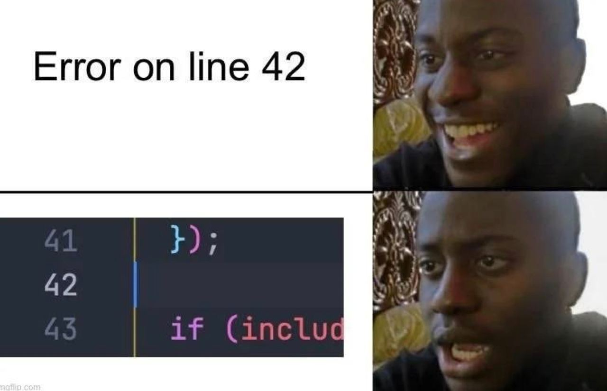

# My 42 Journey

Hey there! I'm Marin. I just finished the 42 Piscine, and I'm super excited to kick off my 42 cursus. This repo is here to share my projects and discoveries during my time at 42. 

##  Projects
- 🐣 Basic C functions:
	- [**Piscine**](./0-piscine/) - Gotta start somewhere! I learned the basics in C.
	- [**libft**](./1-libft/) - I built my own basic C library.
	- [**ft_printf**](./2.0-ft_printf/) - I created my own implementation of printf.
	- [**get_next_line**](./2.1-get_next_line/) - Unlocked the magic of reading files line by line!

- ♻️ [**push_swap**](./3.0-push_swap/) - An introduction to sorting algorithms through restricted operations. 

- 🕹️ [**so_long**](./3.1-so_long/) - Ever played pokemon HeartGold? I designed and coded my own minigame using 42's [minilibx](https://github.com/42Paris/minilibx-linux), an X11-based library.

- 🚰 [**pipex**](./3.2-pipex/) - A program reproducing the pipe `|` behavior. ~~Such a pain in th~~ Such a thrilling project!

- 🍽️ [**Philosophers**](./4.0-Philosophers/) - In progress! I'm handling threads routine: eat, sleep, think, die.

-  [**Minishell**](./4.1-Minishell/) - In progress! A group project in which [Aleksei]() and I create our own basic reproduction of bash.

## 🔧 System Administration 

- 🌱 [**Born2beRoot**](./2.2-Born2beroot/) - I set up a secure server environment following strict guidelines. 

## Contact

For any further information, feel free to contact me on [mbecker@student.42.fr](mailto:mbecker@student.42.fr) or to take a look at [marinbecker.com](https://www.marinbecker.com) !

## Still here ?!

You manage to read this entire presentation, congrats !   
Here's a cool meme for you to look at :

	

